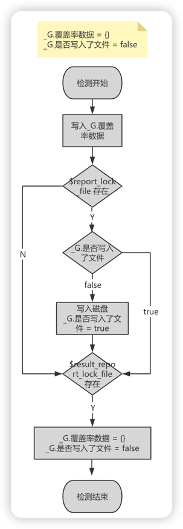

<div align="center">
    <h1>LuaCov - Skynet</h1>
    
    <p align="center">
        Coverage analyzer for Skynet
    </p>
</div>

<br>

## 概述
`LuaCov-Skynet`是专为`Skynet`框架定制的覆盖率分析库。

该项目是 [LuaCov](https://github.com/lunarmodules/luacov) 的扩展。其中`lcov`格式的转换程序源自 [luacov-reporter-lcov](https://github.com/daurnimator/luacov-reporter-lcov)。

`LuaCov`本身不支持多线程安全，每个`actor`分别输出不同的文件。文件的后缀使用`.actor.{skynet.self()}`来拼接。

覆盖率结果以`lcov`格式输出，可以通过 [lcov](https://man.archlinux.org/man/lcov.1.en) 命令合并多个`actor`的结果。然后使用 [diff-cover](https://github.com/Bachmann1234/diff_cover) 进行增量覆盖率和页面生成。

## 下载安装
1. 克隆项目后，编译`src/fileutil.c`生成`fileutil.so`库;
2. 将`src/bin/luacov`复制到系统的任意可执行路径。

## 使用说明
### 第一步: 导入模块
在所有需要检测覆盖率的Lua代码开头添加:
```lua
require("luacov.tick").init()
```

### 第二步: 生成原始覆盖率文件
覆盖率数据在内存中，通过创建文件进行跨进程通信。

指定生成原始文件的文件标识名:
```lua
-- defaults.lua
report_lock_file = "luacov.report"
```
在项目主目录下执行以下命令:
```shell
touch luacov.report
```

要重置执行结果的文件标识名:
```lua
-- defaults.lua
result_report_lock_file = "luacov.report.reset"
```
创建后立即删除即可。

### 第三步：转换为 lcov 格式
执行以下命令自动在当前目录下生成`lcov`格式的文件:
```shell
luacov -r lcov -s luacov.stats.out.actor.1
```
其中，.actor.是固定的，luacov.report.out取自default.lua的reportfile配置。

### 合并多个 actor 的 lcov 文件
使用以下命令合并多个`actor`的`lcov`文件:
```shell
lcov -a luacov.stats.out.actor.1 -a luacov.stats.out.actor.2 -o luacov.report.out.lcov
```
创建`$report_lock_file`后，必须创建`$luacov.report.reset`来重置状态。由于代码执行是事件驱动的，无法保证创建`$report_lock_file`文件后立即执行每个`actor`的代码。为了准确获取`100%`的覆盖率，业务方需要提供一个基于`Skynet`可以调用所有`actor`的方法。


## 执行流程



## 拓展
非`skynet`项目可以把`skynet.self()`替换成获取对应的进程`id`等唯一标识即可应用。